# AuthSessionKit

[](https://swift.org)
[](https://developer.apple.com)
[](https://www.swift.org/package-manager/)
[](LICENSE)

<p align="center">
  
</p>

A Swift package that manages the **lifecycle of an authentication session** on Apple platforms — fetching, validating, refreshing, biometric gating, sign-in / sign-out, and broadcasting state changes to multiple observers.

`AuthSessionKit` is intentionally split into two products so that feature modules can depend only on the public surface (protocols, enums, errors) without pulling in the implementation. This keeps build times low and makes the package easy to mock in tests.

- **Platforms**: iOS 14+, macOS 10.15+, Mac Catalyst 14+
- **Swift**: 6.3 (language mode `.v6`, full strict concurrency)
- **Dependencies**:
  - [`BiometricAuthKit`](https://github.com/kaVish2214/BiometricAuthKit) — `BiometricAuth`, `BiometricAuthInterface`
  - [`UtilityKit`](https://github.com/kaVish2214/UtilityKit) — `MultiCastDelegate`, `SwiftConcurrency`

---

## Products

| Product | Role | Depend on it when… |
| --- | --- | --- |
| **`AuthSessionInterface`** | Protocols, enums, errors, events, delegates — the public contract of an authentication session. Contains **no implementation logic**. | Your module needs to *describe*, *consume*, or *mock* a session (e.g. feature modules, view models, test doubles). |
| **`AuthSession`** | Concrete implementation of the interface: `AuthSessionHandle`, status machine, event proxies, biometric integration, foreground-validation logic. | Your module needs to *create* and *own* a real session handle (typically the app's composition root). |

---

## Module Map

```
AuthSessionKit/
├── Sources/
│   ├── AuthSessionInterface/        ← product 1 (public contract)
│   │   ├── Session/
│   │   │   ├── AuthSessionProtocol.swift
│   │   │   ├── AuthSessionEventProxy.swift           ← inbound (provider → handle)
│   │   │   └── AuthSessionEventPublisher.swift
│   │   ├── SessionProvider/
│   │   │   └── AuthSessionProviderProtocol.swift
│   │   ├── SessionHandle/
│   │   │   └── AuthSessionHandleProtocol.swift
│   │   ├── User/
│   │   │   └── AuthSessionUserProtocol.swift
│   │   ├── Delegate/
│   │   │   └── AuthSessionDelegate.swift
│   │   ├── Proxy/                                    ← outbound (handle → private listener)
│   │   │   ├── AuthSessionDelegateEvent.swift
│   │   │   ├── AuthSessionDelegateEventProxy.swift
│   │   │   └── AuthSessionDelegateEventPublisher.swift
│   │   └── Enum/
│   │       ├── AuthSessionStatusProtocol.swift
│   │       ├── AuthSessionEvent.swift
│   │       └── AuthSessionError.swift
│   │
│   └── AuthSession/                 ← product 2 (implementation)
│       ├── Enum/
│       │   └── AuthSessionStatus.swift
│       ├── Handle/
│       │   ├── AuthSessionHandle.swift
│       │   ├── Handle+ProviderEventListen.swift
│       │   ├── Handle+LocalValidation.swift
│       │   ├── Handle+SessionState.swift
│       │   ├── Handle+Biometric.swift
│       │   └── Handle+Notifications.swift
│       └── EventProxy/
│           ├── SessionHandleEventProxy.swift
│           └── SessionBiometricEventProxy.swift
│
└── Tests/AuthSessionKitTests/
    └── AuthSessionKitTests.swift
```

---

## `AuthSessionInterface` — the Public Contract

A protocol-first surface that describes *what* an authenticated session is, without committing to *how* it's stored, fetched, or refreshed.

### Session model

#### `AuthSessionProtocol`
The minimal shape of an active session: `accessToken`, `expiresAt`, `expiresIn`, and the signed-in `user`. Default implementations:

| Member | Default | Notes |
| --- | --- | --- |
| `expiresIn` | derived from `expiresAt` | Never negative — `max(timeIntervalSinceNow, 0)`. |
| `isSessionExpired` | `expiresAt - now < 120s` | The **120-second buffer** absorbs network latency and clock drift, so a session that's about to expire is treated as expired *before* the next request fails. |

#### `AuthSessionUserProtocol`
The authenticated user. `Hashable` + `Sendable`, with a single `identifier: String` requirement — safe to use as a dictionary key and across concurrency domains.

### Session ownership

#### `AuthSessionProviderProtocol`
Vends and manages a session. Conformers are responsible for fetching, refreshing, signing in / out, and answering policy questions. The protocol **refines `BiometricAuthenticationRequestor`** from `BiometricAuthInterface`, so conformers must also implement:

- `preferredAuthenticationReason() -> String` — the reason shown in the Face ID / Touch ID system prompt.
- `canPerformAuthentication() -> Bool` — whether the device + provider are currently in a state where biometric is allowed.

Provider-owned policy knobs:

| Property / Method | Default | Purpose |
| --- | --- | --- |
| `allowsLocalSessionValidation` | `true` | Should the handle run local expiry checks on foreground? |
| `isSessionAutoRefreshEnabled` | `false` | Does the provider refresh tokens itself? |
| `allowsSessionSigningOutOnBiometricAuthenticationFailure(with:)` | `true` | Should a biometric failure force sign-out? Return `false` to keep the session alive and surface the error to delegates instead. |
| `setBioMetricAuthentication(_:)` | — | Enables / disables biometric requirement. |
| `signout(with:)` / `signout()` | — | Voluntary or error-driven sign-out. |
| `initializeSessionProvider(for:)` | — | Called once by the handle to hand over an `AuthSessionEventProxy` the provider uses to publish lifecycle events. |

#### `AuthSessionHandleProtocol`
The reference-typed owner of a session and its provider. Conforms to `DelegateMultiCasting` (from `MultiCastDelegate`) so multiple observers can subscribe to the same handle.

| Member | Purpose |
| --- | --- |
| `sessionProvider` | The underlying provider. |
| `session` | The current session, or `nil`. |
| `sessionStatus` | The current `AuthSessionStatusProtocol` value. |
| `isBiometricAuthenticationInProcess` | Whether a Face ID / Touch ID alert is currently presented. |
| `isManualAuthenticationRequired` | Set to `true` when biometric failed *and* the provider opted not to sign out — auto-validation on foreground is paused until the UI calls `requestManualAuthentication()`. |
| `isBioMetricAuthenticationEnabled` *(ext.)* | Mirrors the provider flag. |
| `setBioMetricAuthentication(_:)` *(ext.)* | Mirrors the provider call. |
| `requestManualAuthentication()` | UI entry point to resume validation after biometric failure. No-op when `isManualAuthenticationRequired` is `false`, so it's always safe to call. |
| `init(sessionProvider:)` | Creates a handle backed by the given provider. |

### State, events, errors

#### `AuthSessionStatusProtocol`
A protocol-shaped enum of session states with Boolean queries: `isSyncing`, `isSignedIn`, `isSignedOut`, `isValidating`, `isBiometricAuthentication`, plus a derived `isLoadingStatus` (true when syncing OR validating OR running biometric). UI layers can drive transitions without depending on the concrete enum.

#### `AuthSessionEvent`
What providers emit through the event proxy:

| Case | Meaning |
| --- | --- |
| `fetchingSession` | Fetch / refresh has started. |
| `sessionFetched(isInitialFetch: Bool)` | Fetch finished. `true` only for the launch-time fetch. |
| `sessionFetchFailed(Error)` | Fetch errored. |
| `sessionSignIn` | User just signed in (interactive). |
| `sessionSignedOut(error: Error?)` | User signed out — `error` is `nil` for voluntary sign-outs. |
| `sessionUpdated((any AuthSessionProtocol)?)` | Session/user data changed without a status transition (e.g., profile edit). |
| `unexpectedError(AuthSessionError)` | Out-of-band error to fan out to delegates. |

#### `AuthSessionError`
All failure modes — `sessionMalformed`, `sessionExpired`, `networkFailure(error:)`, `biometricAuthFailure(error:)`, `userUpdateFailure(error:)`, `signingInFailure(error:)`, `signingOutFailure(error:)`, `sessionFetchFailed(error:)`. Conforms to `LocalizedError` with user-facing strings (e.g. `"The authentication session has timed out."`, `"Sign-out failed: <underlying>"`).

#### `AuthSessionDelegate`
A `MultiCastDelegate` for observing the handle. Callbacks for:

- `didCompleteFetchWith:isInitialFetch:` — fetch finished.
- `didUpdateStatus:from:for:` — status transitioned.
- `didLoginWith:for:` — user signed in.
- `didLogoutWith:` — user signed out (carries the triggering error if any).
- `didUpdate user:for:` — user data changed.
- `didFailWith:for:` — an `AuthSessionError` occurred.

Most methods ship with no-op defaults so observers implement only what they care about.

### Event plumbing

`AuthSessionInterface` ships **two independent event channels** flowing in opposite directions. Don't confuse them — they carry different payload types, point at different participants, and exist for different reasons.

| Channel | Direction | Payload | Purpose |
| --- | --- | --- | --- |
| **`AuthSessionEventPublisher` / `AuthSessionEventProxy`** | Provider → Handle | `AuthSessionEvent` | The provider publishes session-lifecycle facts ("I'm fetching", "fetch succeeded", "user signed out") that the handle consumes to drive its state machine. |
| **`AuthSessionDelegateEventPublisher` / `AuthSessionDelegateEventProxy`** | Handle → private listener | `AuthSessionDelegateEvent` | The handle re-emits delegate-shaped notifications through a closure, so types that need to react to session changes don't have to expose public `AuthSessionDelegate` conformance. |

#### Inbound: `AuthSessionEventPublisher`
The base protocol for delivering events upstream: `publish(_:for:)` plus a convenience `publish(_:)` that drops the provider parameter. **Consumed by the handle.**

#### Inbound: `AuthSessionEventProxy`
A specialization of `AuthSessionEventPublisher` initialized with a `@Sendable (AuthSessionEvent) -> Void` closure that forwards each event — keeping the handle decoupled from any protocol the provider would otherwise need to conform to. The handle hands this proxy to the provider in `initializeSessionProvider(for:)`.

#### Outbound: `AuthSessionDelegateEvent`
A flat enum that mirrors the `AuthSessionDelegate` callbacks one-for-one:

| Case | Maps to delegate method |
| --- | --- |
| `sessionFetch(isInitial: Bool)` | `didCompleteFetchWith:isInitialFetch:` |
| `login` | `didLoginWith:for:` |
| `logout(error: Error?)` | `didLogoutWith:` |
| `sessionStatusChanged(oldValue:newValue:)` | `didUpdateStatus:from:for:` |
| `failure(error: AuthSessionError)` | `didFailWith:for:` |
| `userUpdate` | `didUpdate user:for:` |

This lets a single closure handle every delegate event with a `switch`, instead of conforming to a 6-method protocol.

#### Outbound: `AuthSessionDelegateEventPublisher`
The base protocol that publishes a `AuthSessionDelegateEvent` together with the originating `AuthSessionHandleProtocol`: `publish(_:for:)`.

#### Outbound: `AuthSessionDelegateEventProxy`
A `Sendable` specialization initialized with a `@MainActor @Sendable (AuthSessionDelegateEvent) -> Void` closure. **The closure is guaranteed to be invoked on the main actor**, so UI code can react without any extra hop.

**Why a second channel exists — keeping delegate routing private.**
`AuthSessionDelegate` conformance is public by nature: any module that imports `AuthSessionInterface` can downcast a delegate and inspect its callbacks. That's the wrong shape for types that *internally* need session signals but don't want to advertise them as part of their API. For example, a view-model or coordinator that updates its own state when the session signs out shouldn't have to expose `func authentication(_:didLogoutWith:)` as a public method.

`AuthSessionDelegateEventProxy` solves this by carrying the routing reaction inside an `init`-time closure rather than a protocol method. The host type holds the proxy (or simply the closure) as a private member, switches on `AuthSessionDelegateEvent`, and reacts — none of that surfaces in its public API. This is the recommended pattern when:

- A class needs to react to session events but **must not** expose delegate methods publicly.
- You want the reaction wired into the listener at construction time (composition root) rather than left for callers to discover.
- You're working from the main actor and don't want manual `DispatchQueue.main.async` hops.

---

## `AuthSession` — the Implementation

### `AuthSessionStatus`
The concrete `AuthSessionStatusProtocol` enum: `.syncing`, `.signedIn`, `.signedOut`, `.validating`, `.biometricAuthentication`. `Hashable + Sendable`. Also exposes two internal queries that gate state transitions cleanly:

| Property | True for |
| --- | --- |
| `allowsBiometricAuthentication` | `.signedIn`, `.syncing`, `.validating` |
| `allowsLocalValidation`         | `.signedIn`, `.syncing` |

### `AuthSessionHandle<AuthSessionProvider>`
The core type. A generic `final class` that is honestly `Sendable` (no `@unchecked`) — every mutable property is protected by a `ConcurrencyContainerProtocol` from `UtilityKit`'s `SwiftConcurrency` product, so the handle is safe to drive from any thread, actor, or queue. It:

1. **Wires up the provider** with a `SessionHandleEventProxy` at init time and constructs a `BiometricAuthManager` (from `BiometricAuthKit`) that points at the provider.
2. **Tracks status** through a single `sessionStatus` accessor backed by a lock-protected `State` struct; transitions fan out a `didUpdateStatus` callback to all subscribed `AuthSessionDelegate`s.
3. **Listens to `didBecomeActiveNotification`** (UIKit on iOS / tvOS / visionOS, AppKit on macOS) to revalidate on foreground.
4. **Guards against premature validation** with `isSessionReadyToValidate` — `validateLocalSessionOrAuthenticateIfNeeded()` short-circuits until the first `sessionFetched` / `sessionFetchFailed` event. Without this, a launch-time `didBecomeActive` would race the initial fetch and yield a false `.signedOut`.
5. **Handles the biometric-prompt foreground race** with `allowsSessionValidationFromNotifications` — the system biometric alert backgrounds and re-foregrounds the app, which would otherwise trigger a second validation cycle. On the **first** activation the handler flips the flag without running validation (deferring to the provider's initial fetch); on subsequent activations it runs validation; while a biometric prompt is in progress the flag is forced off.
6. **Supports manual re-authentication** via `isManualAuthenticationRequired` + `requestManualAuthentication()`, used when the provider opts *not* to sign out on biometric failure. The flag auto-clears when the session leaves `.validating`, enters `.signedOut`, or receives a `.sessionSignedOut` event — preventing it from leaking across sessions.
7. **Cleans up** the notification observer in `deinit`.

#### Thread-safety model

Mutable members split into two categories, each protected appropriately:

| Category | Members | Mechanism |
| --- | --- | --- |
| **Continuously-mutated scalars** | `sessionStatus`, `isManualAuthenticationRequired`, `isSessionReadyToValidate`, `allowsSessionValidationFromNotifications` | Held in a private `Sendable` `State` struct behind a `ConcurrencySafeContainer`. Every read and write goes through `withLock`, with `Sendable` enforcement on both input and output. |
| **Write-once-during-init references** | `sessionEventProxy`, `biometricAuthentication`, `notificationObserver` | `private(set) nonisolated(unsafe) var`. Assigned exactly once during `init` — before any external thread can observe `self` — then strictly read-only. A lock here would be pure overhead; the invariant is *"no writes after init"*. |

The backing lock is OS-adaptive — `Mutex` (iOS 18+ / macOS 15+) → `OSAllocatedUnfairLock` (iOS 16+ / macOS 13+) → `NSLock`. Critical sections **never** wrap external calls (delegate dispatch, provider sign-out, biometric authenticate) so there's no re-entrancy or deadlock risk.

#### Init ordering invariant

`sessionEventProxy` and `biometricAuthentication` are assigned **before** `sessionProvider.initializeSessionProvider(for:)`. A provider that synchronously publishes events during initialization sees a fully-wired handle when the event listener fires — the biometric branch in local validation cannot be silently skipped, and signout-failure error publishes reach the proxy instead of being dropped.

The handle is split into focused extensions for readability:

| File | Responsibility |
| --- | --- |
| `AuthSessionHandle.swift` | Stored state, init / deinit, status setter, manual-auth flag toggles. |
| `Handle+ProviderEventListen.swift` | The closure passed to the event proxy — maps each `AuthSessionEvent` onto status transitions and delegate calls. Initial fetch runs `validateLocalSessionOrAuthenticateIfNeeded`; subsequent fetches run `handleSessionStatusOnceFetched`. |
| `Handle+LocalValidation.swift` | The launch / foreground validation routine (`validateLocalSessionOrAuthenticateIfNeeded`). Decides between expiry-driven sign-out, biometric prompt, or straight-to-`.signedIn` based on provider policy. |
| `Handle+SessionState.swift` | Post-fetch state evaluation (`handleSessionStatusOnceFetched`) for token refreshes; guards against clobbering an in-progress biometric prompt. |
| `Handle+Biometric.swift` | `SessionBiometricEventProxy` conformance — biometric success → `.signedIn`; biometric failure consults `allowsSessionSigningOutOnBiometricAuthenticationFailure(with:)` to choose between sign-out and manual-auth-required. |
| `Handle+Notifications.swift` | `didBecomeActiveNotification` observer with first-activation deferral. |

### Event proxies

- **`SessionHandleEventProxy`** — forwards provider events to the handle's closure listener, and bridges `BiometricAuthenticationDelegator` callbacks (`authenticated()`, `authenticationFailed(with:)`, `authenticationRequestInProcess(didChange:to:)`) back through the handle via `SessionBiometricEventProxy`. Holds a **weak** reference to the biometric proxy so it can't extend the handle's lifetime.
- **`SessionBiometricEventProxy`** (internal protocol) — the seam the proxy uses to push biometric outcomes (`set(sessionStatus:)`, `biometricAuthenticationFailure(with:)`, `biometricAuthenticationBeingAuthenticated()`) to the handle without coupling it to `BiometricAuthenticationDelegator`.

---

## Lifecycle at a Glance

```
                                                         INBOUND (provider → handle)
                                                         AuthSessionEvent
                                                                  │
   ┌─────────────┐                                                ▼
   │  Provider   │ ───── publish(.fetchingSession) ─────► ┌─────────────────────┐
   │             │ ───── publish(.sessionFetched(...))──► │ AuthSessionHandle   │
   │             │ ───── publish(.sessionSignedOut) ────► │                     │
   └─────────────┘                                        │ (status machine)    │
                                                          └─────────┬───────────┘
                                                                    │
                          ┌─────────────────────────────────────────┤
                          │                                         │
                          ▼                                         ▼
                AuthSessionDelegate                  OUTBOUND (handle → private listener)
                    (multicast,                      AuthSessionDelegateEvent
                  public observers)                  via @MainActor closure
                                                       (e.g. internal coordinators
                                                        that don't expose
                                                        delegate methods)
```

The handle has **two listener-facing surfaces**:

- **`AuthSessionDelegate`** for public observers that opt-in by conforming to the protocol and calling `subscribeDelegate(_:receive:)`.
- **`AuthSessionDelegateEventProxy`** for private listeners that want to react to the same signals via a closure, without surfacing delegate methods in their own API.

Inside the handle, every `AuthSessionEvent` is mapped to status transitions and (where applicable) re-emitted as an `AuthSessionDelegateEvent`:

```
                  ┌────────────────── AuthSessionEvent ──────────────────┐
                  │ fetchingSession     ───► status = .syncing           │
                  │ sessionFetched      ───► validateLocalSessionOr…()   │
                  │ sessionFetchFailed  ───► handleSessionStatusOnce…()  │
                  │ sessionSignIn       ───► status = .signedIn          │
                  │ sessionSignedOut    ───► status = .signedOut         │
                  │ sessionUpdated      ───► notify delegates            │
                  │ unexpectedError     ───► notify delegates            │
                  └──────────────────────────────────────────────────────┘
```

**Validation decision tree** (`validateLocalSessionOrAuthenticateIfNeeded`):

```
isSessionReadyToValidate == false ─────────────────────────► (no-op)
session == nil ─────────────────────────────────────────────► .signedOut
biometric prompt already in progress ──────────────────────► (no-op)

allowsLocalSessionValidation = true  (and status allowsLocalValidation)
  set status = .validating
  ├─ expiresIn ≤ 180s ─────────────────────────────────────► signout(.sessionExpired)
  ├─ provider.canPerformAuthentication() == true ─────────► .biometricAuthentication
  └─ otherwise ───────────────────────────────────────────► .signedIn

allowsLocalSessionValidation = false
  ├─ canPerformAuthentication() + status allowsBiometricAuthentication ► .biometricAuthentication
  ├─ canPerformAuthentication() (otherwise) ──────────────► .signedIn
  └─ status was .syncing ────────────────────────────────► .signedIn
```

**Post-fetch evaluation** (`handleSessionStatusOnceFetched`, used for token refreshes and fetch failures):

```
session == nil ──────────────────────────────────────────► .signedOut

allowsLocalSessionValidation = false && isSessionAutoRefreshEnabled
  ├─ biometric prompt in progress ───────────────────────► (no-op, prompt drives status)
  └─ otherwise ──────────────────────────────────────────► .signedIn

otherwise
  ├─ session.isSessionExpired ────────────────────────────► signout(.sessionExpired)
  ├─ biometric prompt in progress ───────────────────────► (no-op)
  └─ otherwise ──────────────────────────────────────────► .signedIn
```

**Biometric failure policy** (`Handle+Biometric.swift`):

```
provider.allowsSessionSigningOutOnBiometricAuthenticationFailure(with: error)
  ├─ true  ──► signout(with: error)
  └─ false ──► enableManualAuthentication()
              status = .signedIn
              publish(.unexpectedError(.biometricAuthFailure(error:)))
```

---

## Installation

Add the package to `Package.swift`:

```swift
dependencies: [
    .package(url: "https://github.com/kaVish2214/AuthSessionKit", from: "0.1.0"),
],
targets: [
    .target(
        name: "MyFeature",
        dependencies: [
            .product(name: "AuthSessionInterface", package: "AuthSessionKit"),
        ]
    ),
    .target(
        name: "MyApp",
        dependencies: [
            .product(name: "AuthSession", package: "AuthSessionKit"),
            .product(name: "AuthSessionInterface", package: "AuthSessionKit"),
        ]
    ),
]
```

Feature modules depend on `AuthSessionInterface` only; the app's composition root depends on both `AuthSession` and `AuthSessionInterface`.

---

## Usage

### 1. Implement the protocol surface

```swift
import AuthSessionInterface
import BiometricAuthInterface

struct MyUser: AuthSessionUserProtocol {
    let identifier: String
}

struct MySession: AuthSessionProtocol {
    let accessToken: String
    let expiresAt: TimeInterval
    let user: MyUser
}

final class MyProvider: NSObject, AuthSessionProviderProtocol, @unchecked Sendable {
    typealias AuthSession = MySession

    private(set) var session: MySession?
    var isBioMetricAuthenticationEnabled: Bool = false

    // MARK: AuthSessionProviderProtocol
    func initializeSessionProvider(for eventProxy: any AuthSessionEventProxy) {
        // Kick off your initial fetch and publish events through `eventProxy`:
        //   eventProxy.publish(.fetchingSession)
        //   eventProxy.publish(.sessionFetched(isInitialFetch: true))
    }

    func setBioMetricAuthentication(_ isEnabled: Bool) { isBioMetricAuthenticationEnabled = isEnabled }
    func signout(with error: Error?) throws { session = nil }

    // MARK: BiometricAuthenticationRequestor
    func preferredAuthenticationReason() -> String { "Unlock your account" }
    func canPerformAuthentication() -> Bool { isBioMetricAuthenticationEnabled }
}
```

### 2. Create the handle in the composition root

```swift
import AuthSession

let provider = MyProvider()
let handle = AuthSessionHandle(sessionProvider: provider)
```

### 3. Observe the handle

`AuthSessionHandleProtocol` conforms to `DelegateMultiCasting`, so subscribe with `subscribeDelegate(_:receive:)` and provide a dispatch queue for callbacks. Subscribers are held weakly — no need to call `unsubscribeDelegate(_:)` on dealloc.

```swift
final class RootCoordinator: NSObject, AuthSessionDelegate, @unchecked Sendable {
    init(handle: AuthSessionHandle<MyProvider>) {
        super.init()
        handle.subscribeDelegate(self, receive: .main)
    }

    func authentication(_ handle: (any AuthSessionHandleProtocol)?,
                        didUpdateStatus status: any AuthSessionStatusProtocol,
                        from oldStatus: any AuthSessionStatusProtocol,
                        for session: (any AuthSessionProtocol)?) {
        switch (status.isSignedIn, status.isSignedOut, status.isLoadingStatus) {
        case (true, _, _):  showHome()
        case (_, true, _):  showSignIn()
        case (_, _, true):  showSplash()
        default: break
        }
    }

    func authentication(_ handle: (any AuthSessionHandleProtocol)?,
                        didFailWith error: AuthSessionError,
                        for session: (any AuthSessionProtocol)?) {
        present(error)
    }
}
```

### 4. (Alternative) React privately via `AuthSessionDelegateEventProxy`

When a type needs to react to session events but **must not** expose public delegate methods, hold an `AuthSessionDelegateEventProxy` instead. The closure is invoked on the main actor, so UI updates are safe.

```swift
import AuthSessionInterface

@MainActor
final class HomeViewModel {

    private var sessionListener: (any AuthSessionDelegateEventProxy)?

    init(sessionListenerType: any AuthSessionDelegateEventProxy.Type) {
        // The reaction is wired in at construction — never exposed publicly.
        sessionListener = sessionListenerType.init { [weak self] event in
            guard let self else { return }
            switch event {
            case .sessionStatusChanged(_, let newValue) where newValue.isSignedOut:
                self.reset()
            case .userUpdate:
                self.reload()
            case .failure(let error):
                self.present(error)
            default:
                break
            }
        }
    }
}
```

The host that owns the handle is responsible for publishing into the proxy (typically via a conforming implementation that wraps the closure and forwards events). No `AuthSessionDelegate` method ever appears on `HomeViewModel`'s public surface.

### 5. Trigger manual re-auth (only when the provider blocks sign-out on biometric failure)

```swift
@IBAction func reAuthenticateTapped() {
    handle.requestManualAuthentication()
}
```

### 6. Real-world example: wiring a Supabase provider

The minimal example above stays inside the package surface. Here's how the same conformance looks when the provider sits in front of a real backend (Supabase shown). It illustrates the patterns most apps actually need: a domain-specific protocol refinement, lock-protected session storage, `weak` event-proxy retention, async wire-up, and translating provider-native events into `AuthSessionEvent`s.

**Domain protocol** — refine `AuthSessionProviderProtocol` to add backend-specific affordances. Constrain the associated `AuthSession` to your concrete session type so callers can use the strong type, not the existential.

```swift
import AuthSessionInterface

public protocol SupabaseSessionProviderProtocol: AuthSessionProviderProtocol
    where AuthSession: SupabaseSessionProtocol {

    var supabaseClient: SupabaseClient { get }

    func signInAnonymously() async throws
}
```

**Conformer** — implements `AuthSessionProviderProtocol` plus the new requirements. Notable patterns inside:

- **Lock-protected session** with `ConcurrencySafeContainer<State>` (same primitive `AuthSessionHandle` uses internally).
- **`nonisolated(unsafe) weak var eventProxy`** — the handle hands ownership of the proxy at init time; the provider keeps it weak so it can publish later without retaining the handle.
- **`isSessionAutoRefreshEnabled = true` + `allowsLocalSessionValidation = false`** — Supabase refreshes tokens itself, so the handle doesn't need to run local expiry checks.
- **Auth-state listener bridges provider events to `AuthSessionEvent`** — `signedIn` → `.sessionSignIn`, `tokenRefreshed` → `.sessionFetched(isInitialFetch: false)`, etc.
- **Biometric flag persisted in `UserDefaults`** — survives launches.

```swift
import AuthSessionInterface
import BiometricAuthInterface
import Supabase
import SwiftConcurrency   // UtilityKit's SwiftConcurrency product

final class SupabaseSessionProvider: NSObject, SupabaseSessionProviderProtocol {

    // MARK: Lock-protected mutable state

    private struct State: Sendable {
        var session: Session?
    }

    private let state: any ConcurrencyContainerProtocol<State> =
        ConcurrencySafeContainer(.init())

    var session: Session? { state.withLock { $0.session } }

    // MARK: Write-once-during-init references

    private(set) nonisolated(unsafe) weak var eventProxy: (any AuthSessionEventProxy)?
    private nonisolated(unsafe) var authStateListener: (any AuthStateChangeListenerRegistration)?

    // MARK: Domain-specific

    let supabaseClient: SupabaseClient = .init(/* … */)

    // MARK: Provider policy (override the protocol defaults)

    var allowsLocalSessionValidation: Bool { false }   // Supabase refreshes for us
    var isSessionAutoRefreshEnabled: Bool { true }

    // MARK: Biometric persistence

    private(set) var isBioMetricAuthenticationEnabled: Bool {
        get { UserDefaults.standard.bool(forKey: "isBiometricAuthEnabled") }
        set { UserDefaults.standard.set(newValue, forKey: "isBiometricAuthEnabled") }
    }

    func setBioMetricAuthentication(_ isEnabled: Bool) {
        isBioMetricAuthenticationEnabled = isEnabled
    }

    // MARK: Provider lifecycle

    func initializeSessionProvider(for eventProxy: any AuthSessionEventProxy) {
        self.eventProxy = eventProxy
        eventProxy.publish(.fetchingSession)

        Task { [weak self] in
            self?.authStateListener = await self?.supabaseClient.auth.onAuthStateChange {
                [weak self] event, session in
                guard let self else { return }
                self.state.withLock { $0.session = session }

                switch event {
                case .initialSession:
                    self.eventProxy?.publish(.sessionFetched(isInitialFetch: true))
                case .signedIn:
                    self.eventProxy?.publish(.sessionSignIn)
                case .signedOut:
                    self.eventProxy?.publish(.sessionSignedOut(error: nil))
                case .tokenRefreshed:
                    self.eventProxy?.publish(.sessionFetched(isInitialFetch: false))
                case .userUpdated:
                    self.eventProxy?.publish(.sessionUpdated(session))
                default:
                    break
                }
            }
        }
    }

    deinit { authStateListener?.remove() }

    // MARK: Sign-in / sign-out

    func signInAnonymously() async throws {
        try await supabaseClient.auth.signInAnonymously()
    }

    func signout(with error: Error?) throws {
        // `signout` is sync by protocol; hop into a Task and publish failures through the proxy.
        Task { [weak self] in
            guard let self else { return }
            do {
                try await self.supabaseClient.auth.signOut()
            } catch {
                self.eventProxy?.publish(.unexpectedError(.signingOutFailure(error: error)))
            }
        }
    }

    // MARK: Biometric requirements

    func preferredAuthenticationReason() -> String {
        "Authenticate with your Supabase account"
    }

    func canPerformAuthentication() -> Bool {
        isBioMetricAuthenticationEnabled
    }

    func allowsSessionSigningOutOnBiometricAuthenticationFailure(
        with error: BiometricAuthenticationError
    ) -> Bool {
        // Map biometric error policy to your UX — e.g., keep the session alive when the user
        // cancels the prompt themselves so they can retry without re-authenticating.
        if case .canceledByUser = error { return false }
        return true
    }
}
```

**Key takeaways from this pattern:**

| Concern | What this example does |
| --- | --- |
| Provider-side state mutation under concurrency | Re-uses `ConcurrencySafeContainer` from `UtilityKit/SwiftConcurrency` — the same primitive the handle uses, so all of the provider's state is thread-safe by construction. |
| Avoiding a retain cycle with the handle | `eventProxy` is `weak`; the handle owns the proxy, the provider just borrows a reference to publish through. |
| Async backend, sync protocol method (`signout(with:)`) | Wrap the call in a `Task` and route failures back through the proxy as `.unexpectedError(.signingOutFailure(error:))` so they fan out to delegates. |
| Mapping backend events to `AuthSessionEvent` | A single `switch` inside the auth-state listener translates Supabase's vocabulary to the package's. The handle's state machine takes it from there. |
| Skipping local validation when the backend auto-refreshes | Override `allowsLocalSessionValidation` to `false` and `isSessionAutoRefreshEnabled` to `true` so the handle defers to the provider's refresh cycle. |

---

## Concurrency

- All public types are `Sendable`. `AuthSessionHandle` is **honestly `Sendable`** — every mutable property is protected by a `ConcurrencyContainerProtocol` (OS-adaptive lock from `UtilityKit/SwiftConcurrency`), so the handle is safe to drive from any thread, actor, or queue.
- The package compiles under Swift 6 strict concurrency (`swiftLanguageModes: [.v6]`).
- **Inbound** events (`AuthSessionEventProxy`) use a `@escaping @Sendable (AuthSessionEvent) -> Void` closure — providers can publish from any actor or executor.
- **Outbound** delegate events (`AuthSessionDelegateEventProxy`) use a `@escaping @MainActor @Sendable (AuthSessionDelegateEvent) -> Void` closure — every reaction is delivered on the main actor, so UI state updates need no extra hop.
- Public `AuthSessionDelegate` callbacks are dispatched **asynchronously on each subscriber's registered queue** — the handle never assumes a thread, and subscribers never block the provider.

---

## Testing

Tests live in `Tests/AuthSessionKitTests/AuthSessionKitTests.swift` and use Apple's [Swift Testing](https://developer.apple.com/documentation/testing/) framework (`@Test`, `@Suite`, `#expect`). The interface module is the test seam — implement light fakes of `AuthSessionProviderProtocol` and `AuthSessionProtocol` to drive the handle through its full state machine without touching real biometric or network code.

Suites currently covered:

| Suite | Focus |
| --- | --- |
| `Initialization` | Default state, provider initialization, event proxy / biometric manager creation. |
| `Status Transitions` | `set(sessionStatus:)` semantics including no-op skips. |
| `Manual Authentication` | Flag toggles, auto-clear on `.validating` exit and `.signedOut` entry, `requestManualAuthentication()` flow. |
| `Session Readiness` | `isSessionReadyToValidate` lifecycle. |
| `Notification Validation Readiness` | `allowsSessionValidationFromNotifications` lifecycle, biometric-prompt interactions. |
| `Event Handling` | Every `AuthSessionEvent` → status transition mapping. |
| `Post-Fetch Session State` | `handleSessionStatusOnceFetched` branches across `allowsLocalSessionValidation` × `isSessionAutoRefreshEnabled` × session expiry. |
| `Local Validation` | `validateLocalSessionOrAuthenticateIfNeeded` branches and 180-second expiry threshold. |
| `Biometric Failure Handling` | Provider-policy-driven signout vs. manual-auth-required. |
| `AuthSessionStatus` | State-query and protocol conformance. |
| `AuthSessionError` | `LocalizedError` descriptions. |
| `AuthSessionProtocol Defaults` | `expiresIn` / `isSessionExpired` math, including the 120s buffer. |
| `Integration` | Full launch flows (valid / expired / missing session, fetch failure, sign-in then sign-out, auto-refresh path). |
| `Delegate Notifications` | Multicast delivery, queue dispatch, multi-subscriber fan-out. |
| `SessionHandleEventProxy` | Event-proxy forwarding, biometric callbacks, weak-handle safety. |
| `Deinit Cleanup` | Handle deallocation and weak-reference behavior. |
| `AuthSessionDelegateEvent` | Case creation and associated-value extraction for the outbound enum. |
| `AuthSessionDelegateEventPublisher` | `publish(_:for:)` contract — event storage, handle identity, order preservation. |
| `AuthSessionDelegateEventProxy` | Closure-based `init(eventListening:)` contract — main-actor delivery and payload fidelity. |
| `Thread Safety` | Aggressive stress harness — 14 tests driving the lock-protected state across a concurrent dispatch queue. Peak loads: 64,000-op sustained burst from 32 parallel writers, 50,000-op chaos-monkey hammering every state surface (status writes, reads, flag toggles, event listener, biometric flag, delegate fan-out under contention), 30,000-op mixed accessor/mutator fan, a 10,000-op subscribe/unsubscribe storm against a 32-delegate pool (exercised in isolation), and 500 concurrent handle constructions. The suite is `.serialized` so each test gets the full thread pool to itself, then everything proves the OS-adaptive `ConcurrencySafeContainer` makes the handle safe under arbitrary multi-threaded use. |
| `Synchronous Init Emission` | Regression for the init-ordering invariant. Uses a provider that publishes `.fetchingSession` and `.sessionFetched(isInitialFetch: true)` synchronously from inside `initializeSessionProvider(for:)`. Asserts the biometric branch fires (proving `biometricAuthentication` is visible during the synchronous validation pass), that `signout` is invoked on an expired session, and that `sessionEventProxy` / `biometricAuthentication` references and the `isSessionReadyToValidate` flag are all visible after init returns. |

---

## Related Packages

| Package | What it provides |
| --- | --- |
| `BiometricAuthKit` | `BiometricAuthManager`, `BiometricAuthentication`, `BiometricAuthenticationDelegator`, `BiometricAuthenticationRequestor`, `BiometricAuthenticationError` — the Face ID / Touch ID layer the handle leans on. |
| `UtilityKit` (`MultiCastDelegate`) | `MultiCastDelegate`, `DelegateMultiCasting`, `DelegateSubscription`, `DelegateSubscriptionHandle` — the weak-multicast infrastructure used by `AuthSessionHandleProtocol`. |
| `UtilityKit` (`SwiftConcurrency`) | `ConcurrencyContainerProtocol`, `ConcurrencySafeContainer` — the OS-adaptive lock (`Mutex` → `OSAllocatedUnfairLock` → `NSLock`) that protects `AuthSessionHandle`'s mutable `State` struct. |

---

## Contributing & Community

- **[Contributing Guide](CONTRIBUTING.md)** — build, coding standards, source headers, and the pull-request process.
- **[Code of Conduct](CODE_OF_CONDUCT.md)** — Contributor Covenant 2.1.
- **[Security Policy](SECURITY.md)** — how to report a vulnerability privately (contact: [92spatter.prose@icloud.com](mailto:92spatter.prose@icloud.com)).
- **[Changelog](CHANGELOG.md)** — notable changes per release.

---

## License

Released under the [Mozilla Public License 2.0](LICENSE). You may use this package in private and commercial applications. If you modify and distribute files from this package, those modified files must remain available under the MPL-2.0.

Copyright © 2026 kaVi Gevariya (@kaVish2214).
